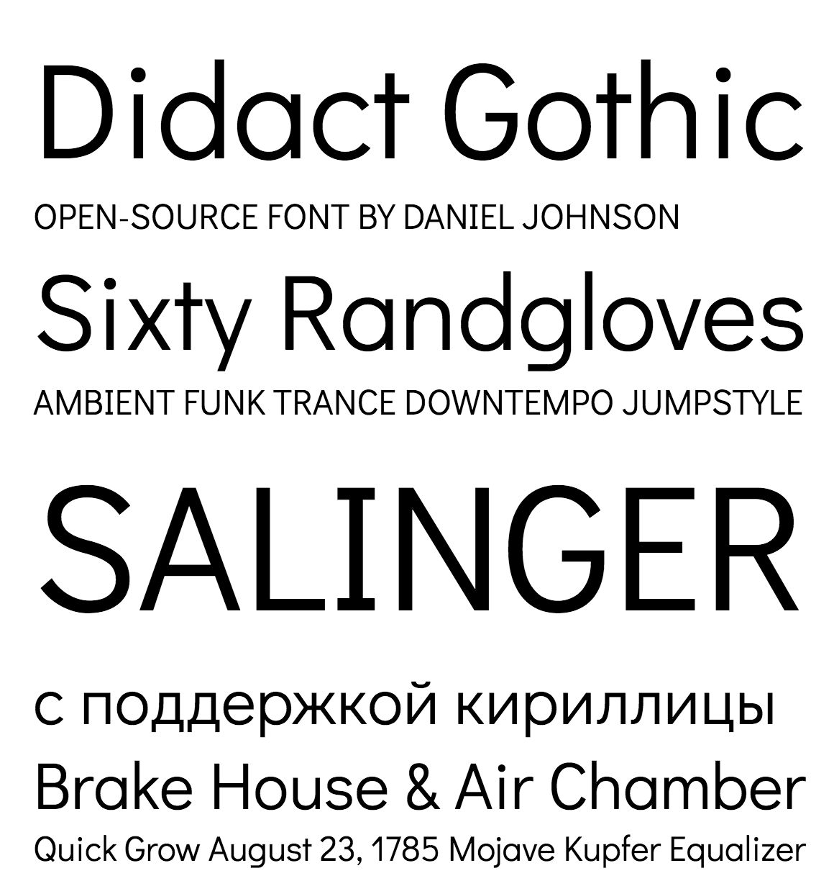

### Didact Gothic

open-source font by Daniel Johnson

Didact Gothic is a sans-serif font designed to present each letter in the form most often used in elementary classrooms. This makes it suitable for literacy efforts.

### Downloads

* [View Didact Gothic on Google Fonts](https://fonts.google.com/specimen/Didact+Gothic)

* [Didact Gothic on Daniel Johnson's website](http://danieljohnson.name/fonts/didact-gothic)

### Recent changes v.2.000 (@alexeiva)

* Design, spacing, and kernign improvements across GF Latin Plus, and GF Cyrillic Plus ranges. 

### Copyright

Copyright (c) 2009, 2010, 2011 Daniel Johnson (<il.basso.buffo@gmail.com>).

### License

This Font Software is licensed under the SIL Open Font License, Version 1.1.
This license is copied below, and is also available with a FAQ at:
http://scripts.sil.org/OFL

